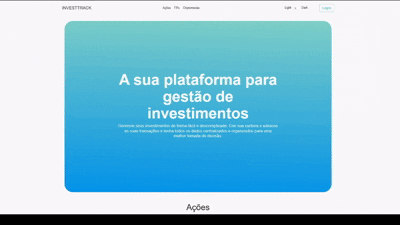
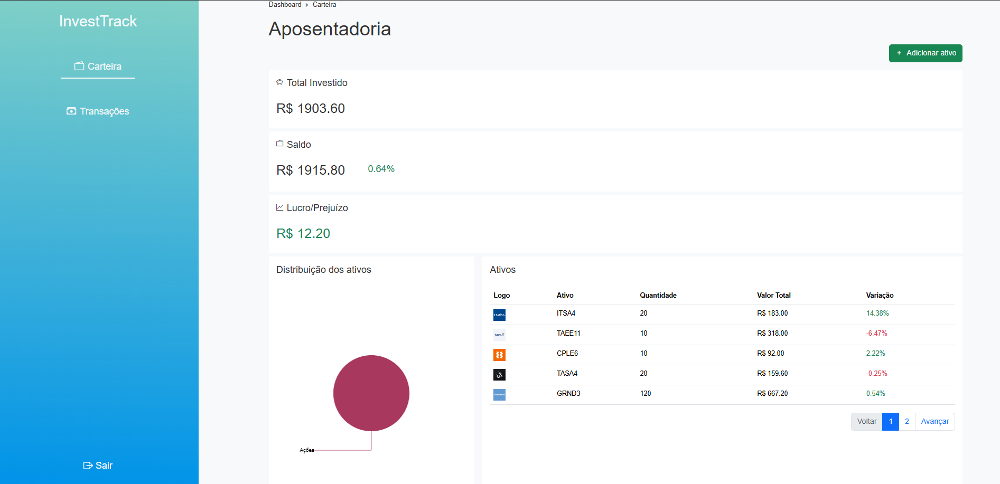
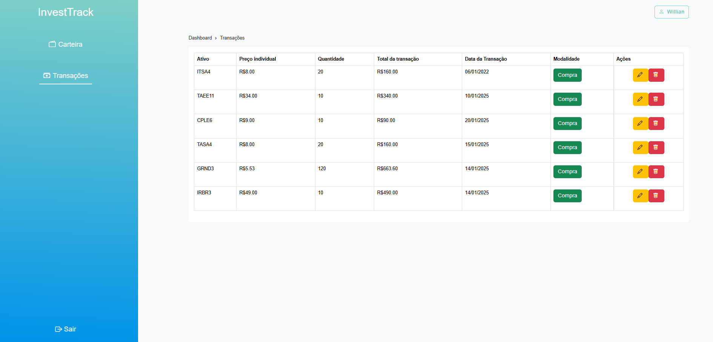
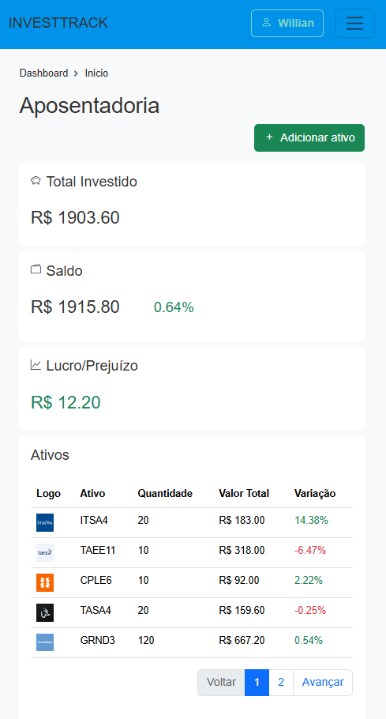

# InvestTrack Frontend

Este projeto é o frontend da aplicação **InvestTrack-API**, desenvolvido com o framework **Angular**. A aplicação interage com a API para gerenciar investimentos, transações e usuários.


## Pré-visualização da aplicação
<p align="center">
  
</p>

<p align="center">
  
  
  
</p>

## Tecnologias Utilizadas

- **Angular**: Framework para construção da interface de usuário.
- **TypeScript**: Linguagem usada para o desenvolvimento do projeto.
- **RxJS**: Biblioteca para programação reativa.
- **Angular CLI**: Ferramenta de linha de comando para facilitar a construção e o gerenciamento de aplicações Angular.
- **Bootstrap** Para o design responsivo e componentes de interface.
- **SweetAlert2** Pop-ups elegantes e customizáveis.
- **ngToast** Notificações em toasts.

## Requisitos

- **Node.js**: Versão recomendada 18.x ou superior.
- **Angular CLI**: Ferramenta de linha de comando do Angular. (Versão recomendada: 15.x ou superior).
- **NPM** ou **Yarn**: Para gerenciar as dependências do projeto.

## Passos para Configuração e Execução

### 1. Clonar o Repositório

Clone o repositório do frontend para sua máquina local:

```bash
git clone https://github.com/WillianGiacomelli/InvestTrack-WebUI
cd investTrack-WebUI
```

### 2. Instalar Dependências

Instale as dependências do projeto usando **npm** ou **yarn**:

```bash
npm install
```

Ou, se você preferir usar o **yarn**:

```bash
yarn install
```

### 3. Configurar o Backend

Certifique-se de que o backend da API (InvestTrack API) esteja rodando corretamente, pois o frontend fará chamadas para a API para recuperar dados. O backend deve estar disponível em `http://localhost:3000` (ou no endpoint configurado no backend).

Você pode fazer o download do projeto backend no repositório:

```bash
git clone https://github.com/WillianGiacomelli/InvestTrack-API
```

### 4. Configurar Variáveis de Ambiente

Para configurar a URL do backend no Angular, crie um arquivo `src/environments/environment.ts` (ou edite o existente) com as variáveis de ambiente necessárias. Exemplo:

```typescript
export const environment = {
  production: false,
  apiUrl: 'http://localhost:3000',  // URL do backend
};
```

### 5. Rodar o Servidor de Desenvolvimento

Agora que as dependências estão instaladas e as configurações estão feitas, você pode iniciar o servidor de desenvolvimento:

```bash
ng serve
```

Isso iniciará a aplicação Angular no ambiente de desenvolvimento. Por padrão, ela estará disponível em `http://localhost:4200`.

### 6. Acessar a Aplicação

Abra seu navegador e acesse a aplicação no seguinte endereço:

```
http://localhost:4200
```

O frontend se comunicará com o backend através da API para gerenciar os dados de investimentos, transações e usuários.

## Comandos Úteis

- **Rodar o Servidor de Desenvolvimento**:

```bash
ng serve
```
- **Build para Produção**:

Para gerar o build de produção (minificado e otimizado):

```bash
ng build --prod
```

Isso gerará os arquivos na pasta `dist/`, prontos para serem enviados ao servidor de produção.

---

## Estrutura de Diretórios

Aqui está a estrutura básica do projeto Angular:

```
investtrack-frontend/
│
├── src/
│   ├── app/                 # Componentes, serviços e módulos da aplicação
│   ├── assets/              # Imagens, fontes e outros recursos estáticos
│   ├── environments/        # Arquivos de configuração para diferentes ambientes
│   └── index.html           # Arquivo principal HTML
│
├── angular.json             # Configurações do Angular CLI
├── package.json             # Dependências e scripts
├── tsconfig.json            # Configurações do TypeScript
└── README.md                # Este arquivo
```

## Contribuindo

1. Faça o **fork** do repositório.
2. Crie uma nova **branch** (`git checkout -b feature/alguma-coisa`).
3. Faça suas alterações e **commite** (`git commit -am 'Adicionando uma nova feature'`).
4. **Push** para sua branch (`git push origin feature/alguma-coisa`).
5. Abra um **pull request**.

## Licença

Este projeto está sob a licença MIT. Veja o arquivo LICENSE para mais detalhes.
